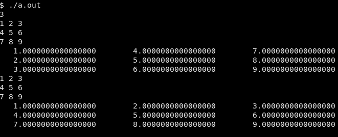

# FisComp 2018

## Projetos

Professor: Eric

* Projeto 1
  * Exercício 1 - fatoriais e a aproximação de Stirling
  * Exercício 2 - série de Taylor para o cosseno
  * Exercício 3 - valores médio e desvio padrão
  * Exercício 4 - organize uma lista
  * Exercício 5 - método da potência e auto{valor,vetor} dominante
* Projeto 2
  * Exercicio 1 - derivada numérica
  * Exercicio 2 - integral numérica
  * Exercicio 2 - equações algébricas não lineares
* Projeto 3
  * Exercicio 1 - ciclista
  * Exercicio 2 - lançamento de projetil
  * Exercício 3 - pêndulo simples
* Projeto 4
  * Exercício 1 - órbitas circulares e elípticas
  * Exercicio 2 - satélite geoestacionário e os efeitos da Lua
  * Exercicio 3 - coreografias celestes
* Projeto 5
  * Exercicio 1 - ponto fixo de período um
  * Exercicio 2 - dobras de período e caos
  * Exercicio 3 - modelo predador-presa

Os projetos da Tereza foram similares, mas o projeto 4 dela foi sobre números
aleatórios.

## Misc

A pasta *misc* tem códigos diversos:

* [`matrix.f90`](misc/matrix.f90) ilustra leitura de matrizes em fortran:
  é por colunas:
  

* [`iso_c_binding.f90`](misc/iso_c_binding.f90) ilustra como usar os
  parâmetros `kind` corretamente e quais valores são compatíveis com o
  padrão C, através do módulo `ISO_C_BINDING` do Fortran 2003:
  

  Sugestão de compilação: `gfortran -Wall -Wextra -Wconversion-extra iso_c_binding.f90`

* [`maxMinValues.f90`](misc/maxMinValues.f90) mostra os valores máximos que
  inteiros de diversos tipos podem ter. Também mostra os valors máximos e
  mínimos de variáveis reais:
  
