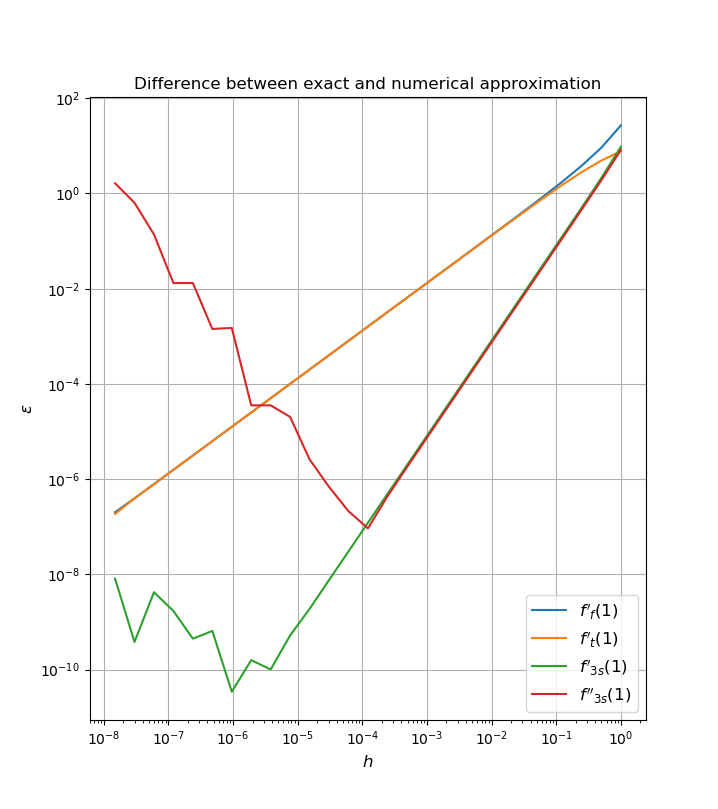
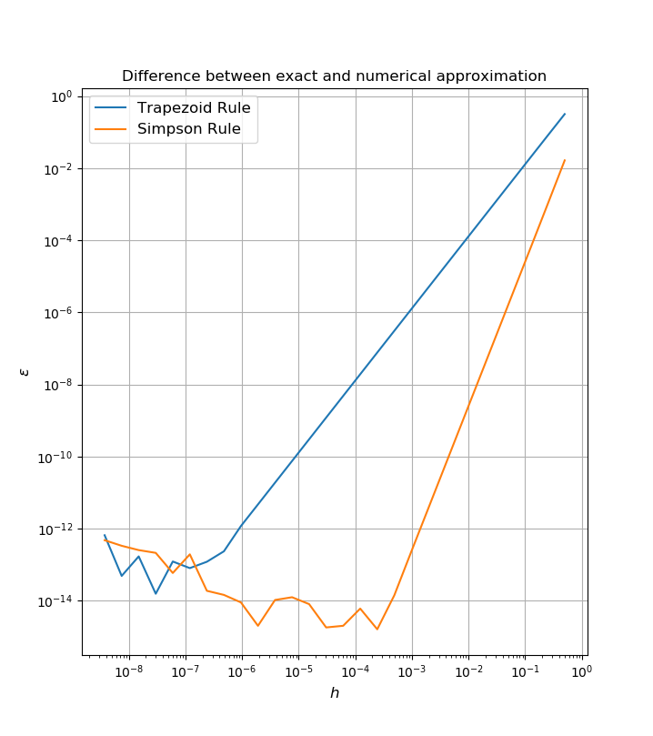
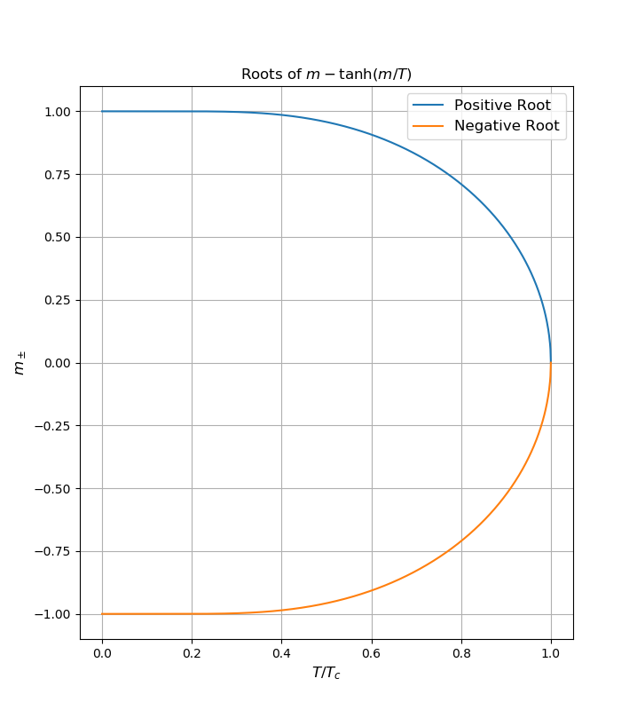

# Projeto 2

## Exercicio 1 - derivada numérica

O código `01.f90` imprime no terminal as diferenças entre cada aproximação
e o valor exato da derivada.

O código `01.py` é um script Python que compila, executa e faz o gráfico
das diferenças em função do tamanho do passo utilizado.

## Exercicio 2 - integral numérica

O código `02.f90` imprime no terminal as diferenças entre cada aproximação
e o valor exato da integral.

O código `02.py` é um script Python que compila, executa e faz o gráfico
das diferenças em função do tamanho do passo utilizado.

## Exercicio 2 - equações algébricas não lineares

O código `03.f90` imprime no terminal as raízes positivas para cada valor
de T entre 0 e 1.

O código `03.py` é um script Python que compila, executa e faz o gráfico
das raízes em função de T.

