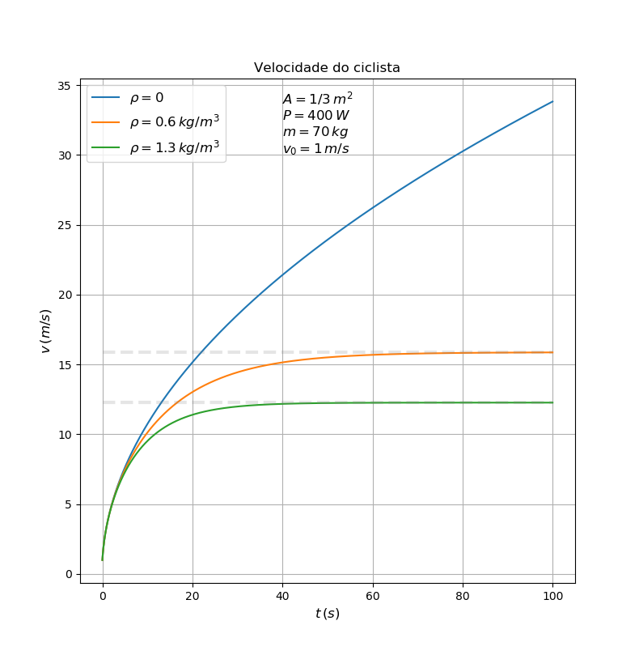

# Projeto 2

## Exercicio 1 - Ciclista

O código `1.f90` imprime no terminal o valor da velocidade do ciclista
para cada instante de tempo.

O código `1.py` é um script Python que compila, executa e faz o gráfico
da velocidade do ciclista para três valores de rho.

