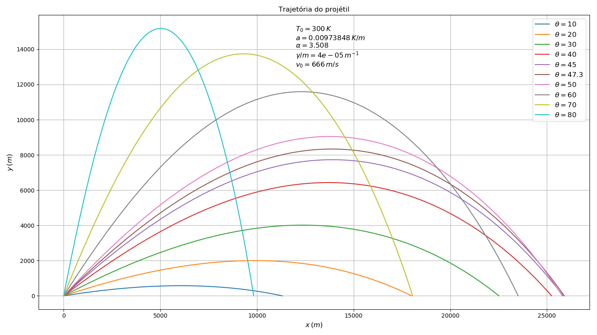

# Projeto 2

## Exercicio 1 - Ciclista

O código `1.f90` imprime no terminal o valor da velocidade do ciclista
para cada instante de tempo.

O código `1.py` é um script Python que compila, executa e faz o gráfico
da velocidade do ciclista para três valores de rho.

## Exercicio 2 - lançamento de projetil

O código `2.f90` recebe como entrada a velocidade inicial, angulo
de lançamento, gamma/m, a, alpha, T0 e dt e imprime no terminal as
coordenadas (x, y) da trajetoria do projetil enquanto y >= 0.

O código `2.py` é um script Python que compila, executa e faz o gráfico
da trajetoria do projetil para diferentes angulos de lançamento.

