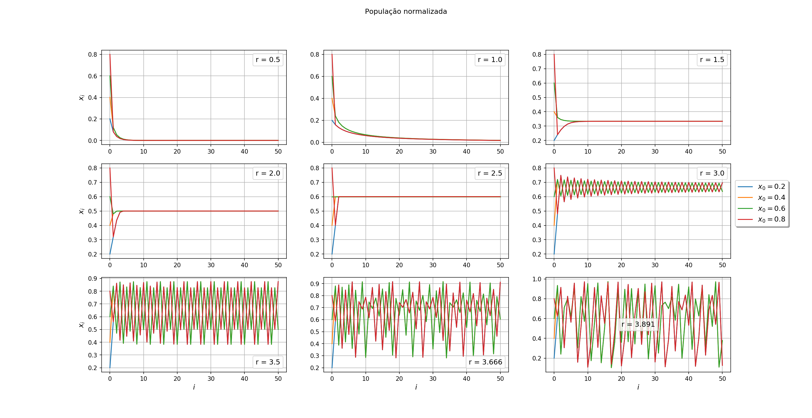
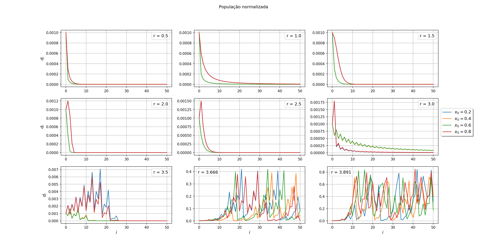
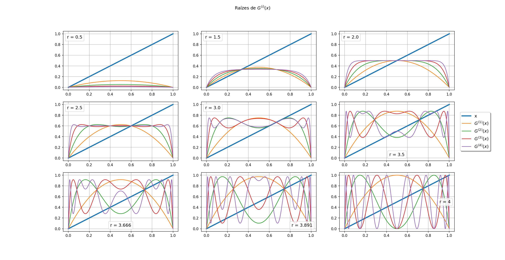
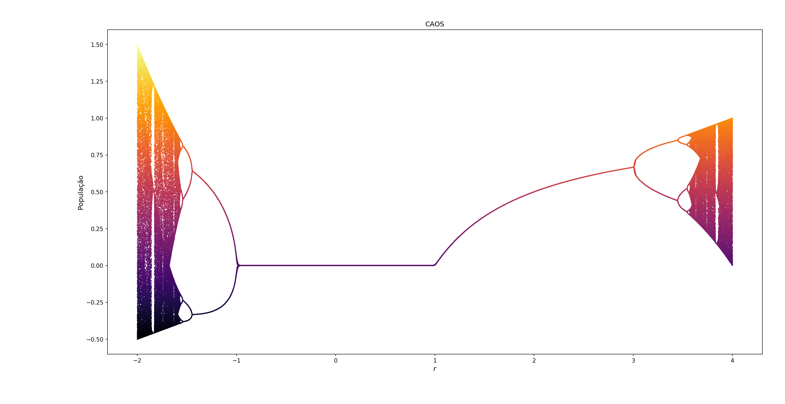
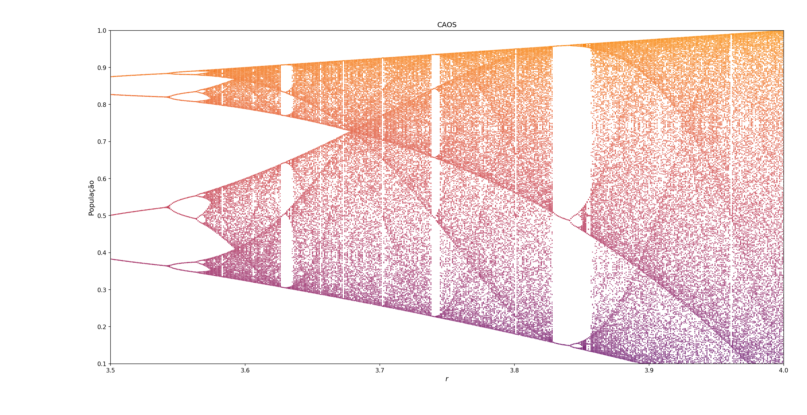
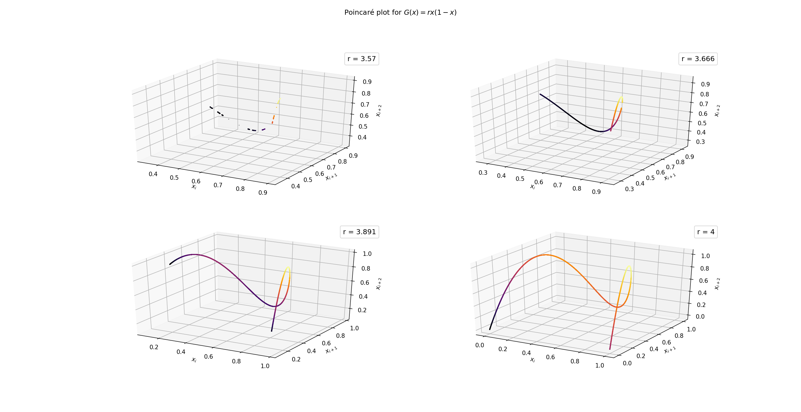

# Projeto 5

## Exercicio 1 - Ponto fixo de periodo 1

O código `1.f90` imprime no terminal `xi, i, d` como pedido nos itens b) e c).

O código `1.py` é um script Python que compila, executa e faz os gráficos:

## Exercicio 2 - CAOS

O código `2.f90` imprime no terminal `xi, r` como pedido no item b).

**Cuidado:** o código produz um arquivo de saída de ~1.5 GB e leva alguns
minutos para terminar de rodar! O arquivo e salvo em `/dev/shm/out_caos`,
garanta que sua RAM tem espaço para isso.

O código `2.py` é um script Python que compila, executa e faz os gráficos:

### Mapas de Poincare

O código `2_poincare.f90` imprime no terminal `xi, xi+1, xi+2`, para fazer um graf 3D.

O código `2_poincare.py` é um script Python que compila, executa e faz os gráficos:

