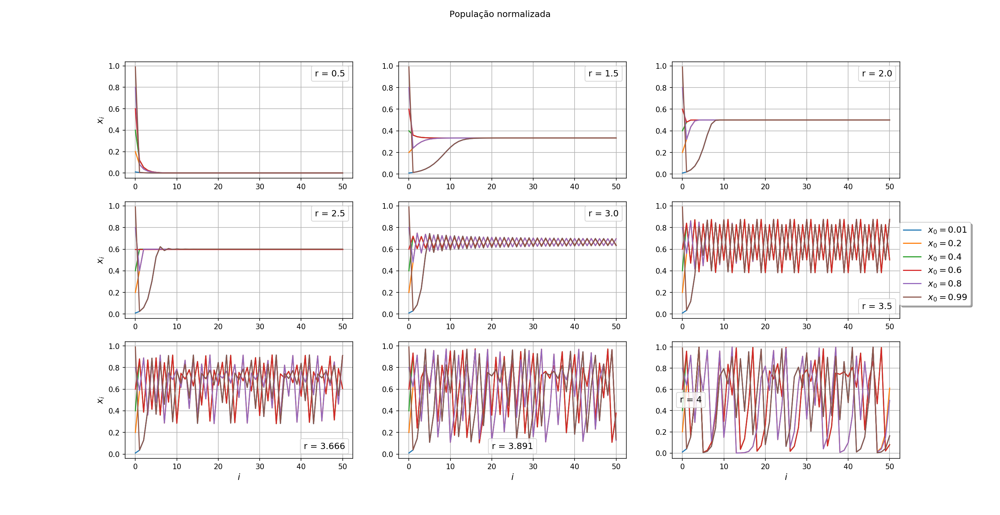

# Projeto 5

## Exercicio 1 - Ponto fixo de periodo 1

O código `1.f90` imprime no terminal `xi, i, d` como pedido nos itens b) e c).

O código `1.py` é um script Python que compila, executa e faz os gráficos:

