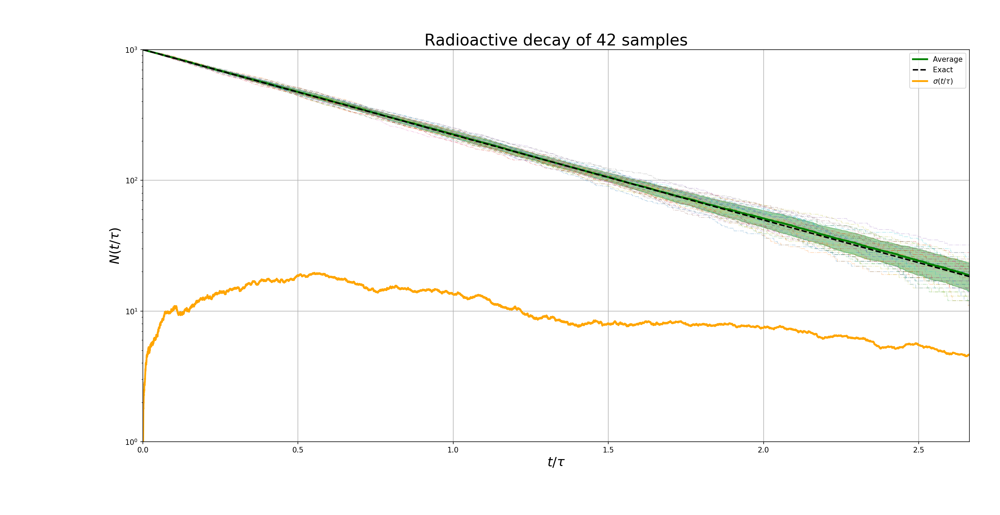

# Projeto 6

## Exercicio 1 - números aleatórios, integrais e amostragem

## Exercicio 2 - decaimento radioativo

O código `2_decaimento.f90` imprime no terminal `t, N` como pedido no item b).

O código `2_decaimento.py` é um script Python que compila, executa e faz os gráficos:

### passeio aleatório
